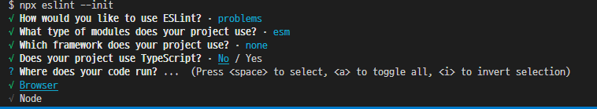

## ✌ 린트(Lint)
> https://jeonghwan-kim.github.io/series/2019/12/30/frontend-dev-env-lint.html

### 🔸 린트가 필요한 상황
- `console.log()` 함수를 실행하고 다음 줄에서 즉시 실행함수를 실행시키는 코드즐 작성
<pre>
console.log()
(function() {})()
// TypeError: console.log(...) is not a function
</pre>
- 이 경우 TypeError 에러가 발생한다.
- 브라우저는 코드에 세미콜론을 자동으로 넣는 과정(ASI)을 수행하기 떄문에 의도대로 해석하지 못하고 아래 코드로 해석하게 된다.
<pre>
console.log()(function(){})();
</pre>
- 린트는 코드의 가독성을 높이는 것 뿐만 아니라 동적 언어의 특성인 런타임 버그를 예방하는 역할도 한다.

### 🔸ESLint
- ESLint는 ECMAScript 코드에서 문제점을 검사하고 일부는 더 나은 코드로 정정하는 린트 도구 중의 하나다.
- 코드에서 검사하는 항목을 크게 분류하면
    - 포맷팅 (글 길이 같은 거)
    - 코드 품질(코드가 잠재적으로 오류를 가지고 있는 것을 체크를 해준다.)
<pre>
$ npm i eslint
</pre>
- `.eslintrc.js` 파일 생성 한다.

#### 🌈 규칙(Rules)
- ESLint는 검사 규칙을 미리 정해 놓았다.
- [ESLint Rules 문법](https://eslint.org/docs/rules/)에서 확인가능
- `.eslintrc.js`에 `no-unexpected-multiline`(기대하지 않은 줄바꿈) 함수와 괄호사이에 줄바꿈이 있으면 오류가 나도록 설정한다.
<pre>
module.exports ={
    rules: {
        "no-unexpected-multiline": "error"
    }
}
</pre>

- `npx eslint app.js` 하면 에러가 발생한다.

- 세미콜론을 붙치고 `npx eslint app.js`하면 잘 실행한다.

- 불필요한 세미콜론이 있을 시 에러가 발생하도록할 땐 `no-extra-semi`를 사용한다.
<pre>
module.exports ={
    rules: {
        "no-unexpected-multiline": "error",
        "no-extra-semi": "error"
    }
}
</pre>

- 콘솔의 에러 메시지를 보면 `1 error and 0 warnings potentially fixable with the '--fix' option.`이라는 메시지를 확인 할 수 있다.
- 뒤에 `--fix`옵션을 주고 실행하면 자동으로 세미콜론이 지워지고 정상적으로 실행이되게 된다.
- 또한, 파일의 불필요한 세미콜론도 자동으로 삭제가 되었다.
<pre>
$ npx eslint app.js --fix
</pre>

- 앞에 렌치 표시가 붙어있으면 `--fix` 명령어를 사용해 자동으로 수정할 수 있다.

- 이러한 필요한 규칙들을 다 일일히 세팅하는 방법보다는 규칙들을 하나의 세트로 만들어 놓은 것을 **Extensible Config**라고 한다.
- 규칙 목록 중에 왼쪽에 체크 표시되어 있는 것이 이설정에서 활성화되어 있는 규칙이다.
<pre>
module.exports ={
    extends:[
        "eslint:recommended"
    ]
}
</pre>
- 만약 이 설정 외에 규칙이 더 필요하마면 `rules` 속성에 추가해서 확장할 수 있다.
- ESLint에서 기본적으로 제공하는 설정 외에 자주 사용하는 두 가지가 있다.
    - airbnb :  [airbnb](https://github.com/airbnb/javascript) 스타일 가이드를 따르는 규칙 모음이다. [eslint-config-airbnb-base](https://github.com/airbnb/javascript/tree/master/packages/eslint-config-airbnb-base) 패키지로 제공된다.
    - standard : [자바스크립트 스탠다드 스타일](https://standardjs.com/)을 사용한다. [eslint-config-standard](https://github.com/standard/eslint-config-standard) 패키지로 제공된다.

#### 🌈 초기화
- 위와 같은 설정은 `--init` 옵션을 추가하면 쉽게 구성할 수 있다.
<pre>
$ npx eslint --init
</pre>

1. To check syntax only: syntax만 체크
2. To check syntax and find problems: 코드 포맷팅이랑 코드 품질까지 체크할꺼다.
3. To check syntax, find problems, and enforce code style: 코드 포맷팅이랑 코드 품질, 코딩 스타일(airbnb, standard)까지 체크할꺼다. 

- 지금 사용하고 있는 모듈은 어떤것을 쓸지를 선택한다.

- 사용하고 있는 프레임워크를 선택한다.

- 타입스크립트를 사용하는지의 여부를 선택한다.

- 이 코드가 노드에서 돌아가는지 브라우저에서 돌아가는지에 대해서 선택한다.

- 설정 파일을 어떤것으로 할지를 선택한다

- eslint 가장 최신버전으로 선택할지의 여부를 선택한다.

- 설치 후 `.eslintrc.js`를 확인하면 변경이 되어 있다.
<pre>
module.exports = {
    "env": { // 환경
        "browser": true,
        "es2020": true
    },
    "extends": "eslint:recommended",
    "parserOptions": {
        "ecmaVersion": 11,
        "sourceType": "module"
    },
    "rules": {
    }
};
</pre>