# ✔ 웹팩(기본)
> - http://jeonghwan-kim.github.io/series/2019/12/10/frontend-dev-env-webpack-basic.html
> - [웹팩 공식 문서](https://webpack.js.org/concepts/)
## ✌ 과거의 경우
- html에 파일 두개를 올려서 다른 파일에 있는 함수를 사용했었다.
<pre>
< script src="src/math.js">< /script>
< script src="src/app.js">< /script>
</pre>
#### ❗ 하지만 이런 방법에는 문제가 존재한다.
- 전역 스코프가 오염된다.
- math.js의 sum이라는 함수는 math 모듈 안에서만 유효한 것이 아니라 해당 애플리케이션이 돌아가는 어느 곳에서나 sum 함수에 접근이 가능하다.

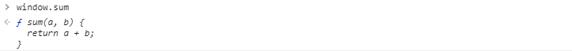

- 자바스크립트는 이런 함수 타입에다가 다른 값을 할당할 수 있다.

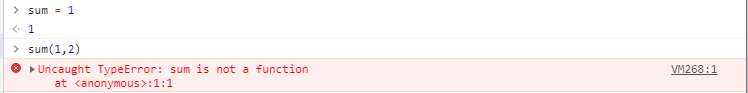
- 이렇게 타입 에러가 발생하게 된다.
- 이렇듯 전역 스코프가 오염되게 되면 애플리케이션이 예측할수 없게 되고 결국엔 런타임 에러가 발생하게 된다.
- 이런 문제를 해결하기 위해서 IIFE 방식의 모듈을 사용을 한다.

## ✌ IIFE 방식의 모듈
- 즉시 실행 함수 표현(IIFE, Immediately Invoked Function Expression)은 정의되자마자 즉시 실행되는 Javascript Function 를 말한다.
- https://developer.mozilla.org/ko/docs/Glossary/IIFE
- 이렇게 되면 함수 안에 독립적인 스코프가 생기게 된다. (외부에서 접근할 수 없다.)
    - 즉, 전역 스코프가 오염되는 문제를 예방할 수 있다.
<pre>
var math = math || {};

(function () {
  function sum(a, b) {
    return a + b;
  }
  // 외부로 호출
  math.sum = sum;
})();
</pre>

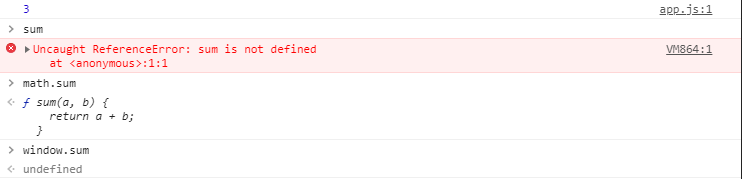

## ✌ 다양한 모듈 시스템
- https://www.zerocho.com/category/JavaScript/post/5b67e7847bbbd3001b43fd73
- 대표적으로 `AMD` 와 `CommonJS`
- `CommonJS`는 자바스크립트를 사용하는 모든 환경에서 모듈을 하는 것이 목표로 `exports` 키워드로 모듈을 만들고 `require()` 함수로 불러 들이는 방식으로 대표적으로 서버 사이드 플래폼인 Nodejs에서 사용한다.
- 브라우저 환경에서는 [AMD](https://en.wikipedia.org/wiki/Asynchronous_module_definition)(*Asynchronous Module Definition*)는 비동기로 로딩되는 환경에서 모듈을 사용한다. (브라우저처럼 외부자바스크립트를 로딩해야할 때(비동기 환경))
- `CommonJS`와 `AMD`를 보두 지원해주는 것이 `UMD`(*Universal Module Definition*)
- 이렇게 각 커뮤니티에서 각자의 스펙을 제안하자 ES2015에서 표준 모듈 시스템을 내 놓았다.
    - 바벨이나 웹팩을 사용해서 모듈 시스템을 사용하는 것이 일반적이다.
<pre>
// export 할 때
export function sum(a, b) {
  return a + b;
}
// import 할 때
import * as math from "./math.js";
import { sum } from "./math.js";
</pre>

## ✌ 브라우져의 모듈 지원
- 모든 브라우져에서 모듈 시스템을 지원하지 않는다.(explorer..)
- 크롬 브라우저에서 사용할때
<pre>
 < script type="module" src="src/app.js">< /script>
</pre>

## ✌ 엔트리/아웃풋 실습
- https://webpack.js.org/
- app.js에서 math.js를 불러오기 때문에 의존관계가 있다고 표현한다.
#### 📌 웹팩이 하는 역할
- 모듈로 연결된 여러개의 javascript 파일을 하나로 합쳐주는 역할을 한다.
- 이렇게 하나로 합쳐진 파일을 번들(bundle)이라고 한다.
- 웹팩이 번들을 만드는 번들러 역할을 한다. (보통 웹팩을 번들러라고도 부른다.)
<pre>
$ npm i -D webpack webpack-cli
</pre>
- 설치하면 *node-modules*안에 *.bin* 폴더안에 webpack과 webpack-cli가 설치되어있는 것을 확인할 수 있다.
- webpack과 webpack-cli로 웹팩을 터미널에서 실행할 수 있게 된다.
#### 📌 웹팩을 실행할 때 필수적인 옵션 3가지
1. `--mode` 옵션 : [선택: "development", "production", "none"] 3가지 값이 올 수 있다.
    - 개발 환경이냐 운영 환경이냐에 따라서 각각 `development`, `production` 을 설정한다.
2. `--entry` 옵션 : 의존 관계가 있는 모듈들의 시작점을 entry혹은 entry point 라고 한다.
    - 모듈의 시작점을 넣어 주어야한다.
    - 이 entry를 통해서 웹팩의 모든 모듈들을 하나로 합친다.
    - 웹팩은 이 시작점을 기준으로 모든 모듈들을 찾아서 하나의 파일로 번들링 해준다.
3. `--outpout, -o` 옵션 : 그 결과를 저장해야 되는데 저장하는 경로를 설정하는 옵션

- 루트 디렉터리에서 명령어를 치면 웹팩 번들링 결과가 나온다.
<pre>
$ node_modules\.bin\webpack --mode development --entry ./src/app.js --output dist/main.js
</pre>
- dist/main.js 파일이 생겼다.
- index.html에 웹팩으로 번들링된 `dist/main.js`를 불러온다.
<pre>
< script src="dist/main.js">< /script>
</pre>
- 이렇게 되면 모든 브라우저에서 동작하게 된다.
- 결과적으로 웹팩은 여러개의 모듈을 하나의 파일로 만들어주는 역할을 한다.
- 매번 이런식으로 터미널에 긴 명령어를 입력할 수 없기 때문에 웹팩 설정 파일을 만든다.
4. `--config` 옵션 : 웹팩 설정을 지정할 수 있다. 
  -  `[문자열] [기본: webpack.config.js or webpackfile.js]`
  - `webpack.config.js` 파일 생성
<pre>
const path = require("path");

module.exports = {
  mode: "development",
  entry: { // 시작점
    main: "./src/app.js",
    main2: "./src/app2.js" // 예
  },
  output: { // 두 가지 인자가 온다
    path: path.resolve("./dist"), // 아웃풋 디렉토리 명을 입력한다.(절대경로)
    filename: "[name].js", // 번들링된 파일명을 입력한다. [name]: entry에서 설정한 키 값(main 이라는 값으로 치환된다.)
  },
};
</pre>
- `filename: "[name].js"` 이런 방식으로 하면 동적으로 파일 이름을 지정할 수 있게 된다.
- 웹팩으로 코드를 번들링하는 과정을 npm script에 등록한다.
<pre>
  "scripts": {
    "test": "echo \"Error: no test specified\" && exit 1",
    <b>"build": "webpack"</b>
  },
</pre>
- npm은 현재 프로젝트에 있는 node모듈을 찾아서 기본 파일 이름인 `webpack.config.js`을 읽어서 `webpack`으로 적는 것이 가능하여 웹팩 번들링 작업을 하게 된다.
<pre>
$npm run build
</pre>
- 터미널에 명령어를 입력했을 때랑 똑같은 결과가 나온다.

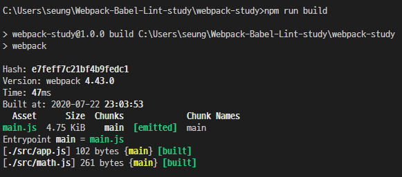

## ✌ 로더
- 웹팩은 모든 파일을 모듈로 바라본다.
- 자바스크립트 뿐만 아니라, CSS, 이미지, 폰트까지도 전부 모듈로 보기 때문에 import 구문을 사용하면 자바스크립트 코드 안으로 가져올 수 있다.
- 이것이 가능한 이유는 웹팩에 **로더**가 있기 때문이다.
    - 모든 파일을 자바스크립트의 모듈처럼 만들어준다.
    - CSS 파일을 자바스크립트에서 직접 로딩해서 사용할 수 있게 해준다.
    - IMG 같은 파일 형식을 데이터 URL 형식의 문자열로 변환한 다음에 자바스크립트에서 이미지 파일을 사용할 수 있게 해준다.
### 🔸 커스텀 로더 만들기
- `my-webpack-loader.js` 작성
- `webpack.config.js` 수정
    - `test` : 로더가 처리해야될 파일들의 패턴을 입력한다. (정규 표현식)
    - `use` : 사용할 로더를 명시한다.
<pre>
  module:{
    rules:[
      {
        test: /\.js$/,   //(.js로 끝나는 모든 파일명을 로더로 돌리겠다.)
        use: [
          // 모든 .js로 끝나는 파일들에서 my-webpack-loader.js가 실행되게끔 설정
          path.resolve('./my-webpack-loader.js')
        ] 
      }
    ]
  }
</pre>
- `npm run build` 로 웹팩 실행

- 콘솔에 `myWebpackLoader가 동작함` 두번찍힌 이유는 src에 app.js와 math.js가 존재하고 js파일별로 로더를 실행하라고 명시했기 때문이다.
- `my-webpack-loader.js`를 `console.log`를 만나면 `alert`창을 띄우게 바꿔본다.
    - `app.js`에 있는 `console.log`를 `alert`창으로 변경하여 alert이 뜬다.
<pre>
return content.replace('console.log(','alert(');
</pre>
- 웹팩의 로더는 각 파일을 처리하기 위한 용도이다.
- 처리해야될 파일의 패턴을 명시하고 이 패턴에 걸리는 파일들은 `use`에 설정한 로더함수를 돌리도록 한다.

### 🔸 자주 사용하는 대표적인 로더
> - [loader 공식 문서](https://webpack.js.org/loaders/)
### 🌂 [css-loader](https://webpack.js.org/loaders/css-loader/)
- 자바스크립트에서 css 파일을 모듈로 불러올 수 있게 해준다.
- es6의 import 구문으로 가져오려면 css 파일이 모듈이 되어야만 하는데 웹팩의 로더가 이 css 파일을 모듈로 바꾸는 역할을 한다.
- 만약 로더를 사용하지 않은채 `import './app.css';` 하면 오류가 난다. (`Module parse failed`)

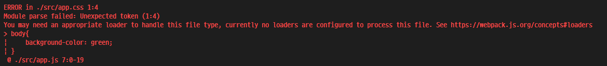

- 사용하기 위해서 `css-loader`를 설치한다.
<pre>
$ npm i css-loader
</pre>
- `webpack.confing.js` 수정
<pre>
{
  test: /\.css$/,
  use:[
      // 웹팩은 엔트리 포인트부터 시작해서 연결된 모든 모듈을 검색하여 css-loader를 찾는다.
    'css-loader'
  ]
}
</pre>
- 설정 후 `npm run build` 성공
- dist/main.js에 css가 있는게 확인된다.
- **하지만 브라우저상에서는 적용이 되지 않는다.**
    - html 코드가 DOM이라는 모습으로 변환이 되어야 브라우저에서 문서가 보이듯이 css 코드도 CSSOM(CSS 객체 모델)으로 바뀌어야만 브라우저에서 모습을 들어낸다.
    - 이렇게 하려면 HTML 파일에서 css 코드를 직접 불러오거나 아니면 인라인 스크립트로 넣어주어야 하는데 아직 그런 처리를 하지 않고 이 자바스크립트 파일에만 CSS 코드가 있어서 브라우저에서 나타나지 않는다.
    - 그래서 나온 것이 **style-loader**이다.
### 🌂 [style-loader](https://webpack.js.org/loaders/style-loader/)

- **style-loader**는 자바스크립트로 변경된 style 코드를 HTML에 넣어주는 loader 이다.
- css코드를 모듈로 사용하고 웹팩으로 번들링하려면 `css-loader`와 `style-loader`를 같이 사용해야 한다.
- `style-loader` 설치
<pre>
$ npm i style-loader
</pre>
- `webpack.config.js`에 `style-loader`추가
- **중요한 점은 로더는 한 파일에 대해서 여러 개가 실행될 수 있는데 use의 순서는 뒤에서부터 앞으로 실행되기 때문에 유의해서 설정해주어야 한다.**
<pre>
{
  test: /\.css$/,
  use:[
    // css-loader부터 실행해야한다.
    'style-loader',
    'css-loader'
  ]
}
</pre>
- 설정 후 `npm run build`를 하면 성공적으로 배경화면이 바뀌게 된다.
    - inline style로 head태그 안에 style이 정의 되어 있다.

### 🌂 [file-loader](https://webpack.js.org/loaders/file-loader/)
- CSS 뿐만 아니라 소스코드에서 사용하는 모든 파일을 모듈로 사용하게끔 할 수 있다.
- css에서 이미지를 불러올 때 에러가 발생한다.
- 이미지를 처리할 수 있는 로더가 `file-loader`이다.
<pre>
body{
    background-image: url(bg.jpg);
}
</pre>
- `file-loader` 설치
<pre>
$ npm i file-loader
</pre>
- `webpack.config.js`에 `file-loader` 추가
<pre>
{
  test: /\.jpg$/,
  use:[
    'file-loader'
  ]
}
</pre>
- 설정 후 `npm run build`를 하면 dist/ 파일에 해시값으로 이미지가 생성된 것을 확인할 수 있다.

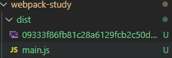
- 웹팩은 빌드를 할 떄 마다 unique한 값을 생성한다.
    - 하는 이유는 캐시 갱신을 위해서 처리한 것이다.
    - 정적 파일인 경우에 브라우저에서 캐시하는 경우는 자바스크립트나 css, 이미지, 폰트들을 성능을 위해서 캐시를 한다.
- 하지만 이렇게 해서 background image가 설정되지 않는다
    - 이미지 url이 설정이 제대로 안되어있기 때문이다.
- `webpack.config.js`의 `file-loader` 수정
    - `options`의 `publicPath` : `file-loader`가 처리하는 파일을 모듈로 사용했을 때 그 경로 앞에 추가되는 문자열로(아웃풋 경로가 dist로 설정되어 있다.), 파일을 호출할 때 앞에 dist를 붙치고 호출하게 된다.
    - `options`의 `name` : `file-loader` 파일 아웃풋으로 복사 할 때 사용하는 파일의 이름을 설정한다.(`[원본 파일명].[확장자 명][해시]`)
    - `[해시]` 캐시 무력화를 위해서 쿼리 스트링으로 매번 달라진 해시값을 입력한다.
<pre>
{
  test: /\.jpg$/,
  loader: 'file-loader', // 로더 이름 설정
  options:{ // 로더에 대한 옵션
    publicPath:'./dist/',
    name: '[name].[ext]?[hash]' 
  }
}
</pre>
- 설정 후 `npm run build`를 하면 ./dist 폴더에 이미지 이름대로 저장되어있는것이 확인이 가능하다.

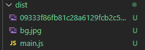

- `./dist/main.js`에서 `bg.jpg`를 찾아보면 접두사와 쿼리스트링으로 매번바뀌는 해시값이 설정되어 호출된 것을 확인 할 수 있다.
- 때문에 호출할 때마다 해시값이 바뀌기 때문에 캐시와 관련된 문제를 해결할 수 있다.

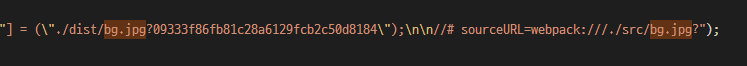

### 🌂 [url-loader](https://webpack.js.org/loaders/url-loader/)
- 사용하는 이미지 개수가 많아지면 네트웍 리소스를 사요하는 부담이 있고 사이트 성능에도 영향을 줄 수 있다.
- 한 페이지에서 작은 이미지를 여러개 사용한다면 [Data URI Scheme](https://en.wikipedia.org/wiki/Data_URI_scheme)을 이용하는 방법이 더 낫다.
- `url-loader`라는 것은 `Data URI Scheme`처럼 이미지를 base64로 인코딩하여 문자열 형태로 소스코드에 넣는 형식이다.
- `url-loader`는 이러한 처리를 자동화해준다.
<pre>
$ npm i url-loader
</pre>
- `url-loader` 설치후 `webpack.config.js`를 수정
    - `url-loader`가 파일들을 처리할 때 `limit` 크기 미만의 파일은 `url-loader`로해서 `base64`로 변환한다.
    - `limit` 크기 이상인 경우는 `file-loader`가 실행하도록 한다.
    - `limit` 크기 미만은 javascript 문자열로 변환하고 그 이상은 파일을 복사한다.
    - 이렇게 하면 `limit` 크기 미만 파일은 `./dist/main.js`에 들어오게 된다.
<pre>
{
  test: /\.(jpg|PNG|gif|svg)$/,
  <b>loader: 'url-loader', </b>
  options:{ 
    publicPath:'./dist/',
    name: '[name].[ext]?[hash]' ,
    <b>limit: 80000,</b> // 80kb 파일 크기를 설정할 수 있다.
  }
}
</pre>
- `./dist/main.js`에 확인해보면 80kb 보다 작은 파일은 main.js에 적혀있는것을 확인할 수 있다.

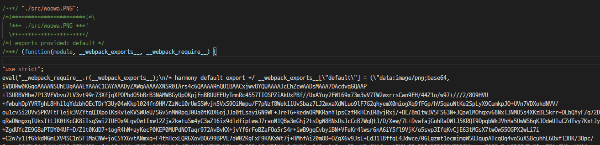

## ✌ 플러그인
- 로더가 각 파일 단위로 처리했던 반먼 플러그인은 번들된 결과물 하나를 처리한다.
- 자바스크립트 코드를 난독화 한다거나 특정 텍스트 용도로 사용한다.
### 🔸 커스텀 플러그인 만들기
- [Writing a plugin](https://webpack.js.org/contribute/writing-a-plugin/)
- 로더는 함수로 정의했던거와는 다르게 플러그인은 클래스로 정의한다.
- `my-webpack-plugin.js` 생성
<pre>
class MyWebpackPlugin {
    apply(compiler){ // apply 생성 후 compiler라는 객체를 주입해준다.
        compiler.hooks.done.tap('My Webpack Plugin',stats =>{
            console.log('My Webpack Plugin : done'); // 플러그인이 완료 됬을 때 실행되는 콜백 함수
        })
    }
}

module.exports = MyWebpackPlugin;
</pre>
- `webpack.config.js`에 추가
    - 로더는 `module` 객체에다가 추가하는 방식이라면 플러그인은 `plugins` 배열에 추가한다.
<pre>
  plugins:[
    // 클래스 객체 생성
    new MyWebpackPlugin() 
  ]
</pre>
- 설정 후 `npm run build`를 하면 콘솔창에 `My webpack Plugin : done` 메시지를 확인할 수 있다.
- 로더가 소스에 있는 여러 개의 파일에 대해서 각각 실행했다면, 플러그인은 파일들을 하나로 뭉처놓은 번들파일에 대해서 딱 한번 실행된다.
#### ❓ 어떻게 플러그인이 번들된 파일에 접근할 수 있을까?
- 웹팩 내장 플러그인 [`BannerPlugin`](https://webpack.js.org/plugins/banner-plugin/) 참고
- `my-webpack-plugin.js` 주석 참고
- `npm run build` 하고 난 뒤 `./dist/main.js`를 확인하면 맨 상단에 주석이 적힌 것을 확인할 수 있다.

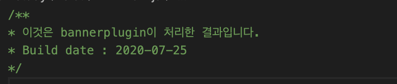

- 이렇듯 웹팩의 로더는 모듈로 연결되어 있는 각 파일들을 처리하고 파일을 하나로 만들어주는데 만들어주기 직전에 플러그인이 중간에 개입해서 아웃풋으로 만들어질 번들링에 후처리를 해준다.

## ✌️ 자주사용하는 플러그인
### 🔸 [BannerPlugin](https://webpack.js.org/plugins/banner-plugin/)
- 결과물에 빌드 정보나 커밋 버젼 같은 것을 추가시킬 수 있다.
- 웹팩이 기본으로 제공하는 플러그인이다.
<pre>
const webpack = require('webpack');
...
  plugins:[
    new webpack.BannerPlugin({
      banner:'BannerPlugin의 banner 입니다.'
    })
  ]
</pre>
- `npm run build` 하면 `main.js`에 BannerPlugin에서 banner로 적은 문자열이 맨 상단에 주석으로 나타난다.
- `webpack.config.js` 수정
    - `child_process`를 사용하여 git의 커밋 버전과 이름, 이메일을 상단 주석으로 작성한다.
<pre>
// node 모듈중에 child process는 터미널 명령어를 실행할 수 있게 해준다.
const childProcess = require('child_process');

  plugins:[
    new webpack.BannerPlugin({
      banner: `
        Build Date: ${new Date().toLocaleString()} // build된 시간
        // git commit 버전의 해시값을 가져온다
        Commit Version: ${childProcess.execSync('git rev-parse --short HEAD')}
        Author: ${childProcess.execSync('git config user.name')}
        Author-Email: ${childProcess.execSync('git config user.email')}
        `
    })
  ]
</pre>
- `main.js` 상단 주석

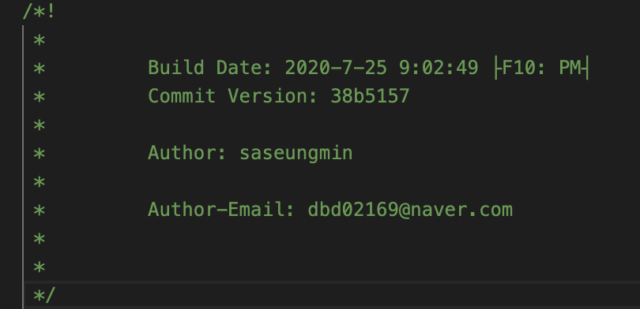

### 🔸 [DefinePlugin](https://webpack.js.org/plugins/define-plugin/)
- 프런드앤드 소스코드는 개발환경과 운영환경으로 나누어서 운영한다.
- 환경에 따라 API 서버 주소가 다를 수 있다.
- 배포할때마다 소스코드를 수정하면 휴먼 에러가 발생하기 쉽고 장애가 일어나기 쉽다.
- 이런 API 주소처럼 환경 의존적인 정보를 소스가 아닌 곳에서 관리하는 것이 좋다.
- 웹팩은 이러한 환경 정보를 제공하기 위해 `DefinePlugin`을 제공한다.
<pre>
  plugins:[
    ...
    new webpack.DefinePlugin({})
  ]
</pre>
- `DefinePlugin`이 기본적으로 애플리케아션에 주입해주는 환경 변수가 있는데 그것이 노드의 환경 변수이다.
- 빈 객체를 전달해도 기본적으로 `process.env.NODE_ENV`인데 웹팩 설정의 `mode`에 설정한 값이 여기에 들어간다.
- 애플리케이션에서 `process.env.NODE_ENV`를 하면 `development` 값이 나온다.
<pre>
mode: "development",
</pre>
- 만약에 애플리케이션에서 `process.env.NODE_ENV`값이 `production`이라고 나오고 싶으면 `webpack.config.js`의 `mode`값을 `production`으로 변경해주면 된다.
- 그 외에 환경변수를 직접 변경하고싶을 땐 아래와 같이 한다.
    - 애플리케이션에서는 TWO라는 전역변수로 접근할 수 있고, 1+1이라는 코드가 실행된다.
<pre>
new webpack.DefinePlugin({
  TWO : '1+1'
})
// 애플리케이션에서 불러올때
console.log(TWO) // 2
</pre>
- 객체 형식으로도 접근 가능하다.
<pre>
new webpack.DefinePlugin({
  TWO : '1+1',
  'api.domain' : JSON.stringify('http://dev.api.domain.com')
})
// 애플리케이션에서 불러올 때
console.log(api.domain)
</pre>

### 🔸 [HtmlTemplatePlugin](https://webpack.js.org/plugins/html-webpack-plugin/)
- 웹팩의 써드 파티 플러그인으로 따로 설치를 해주어야 한다.
- HTML 파일을 후처리하는데 사용한다.
- 빌드 타임의 값을 넣거나 코드를 압축할 수 있다.
- 웹팩의 빌드과정중 html 파일도 넣고싶을때 사용한다.
<pre>
$ npm i html-webpack-plugin
</pre>
- `index.html` 파일을 src로 옮겨서 소스파일로 관리하겠다는 것을 알려준다.
- `index.html`에 javascript 로딩하는 구문을 지운다.(``)
- `webpack.config.js`파일에서 `HtmlwebpackPlugin`을 세팅한다.
- `plugins`에 추가
    - 옵션을 전달할 때 템플릿 경로를 전달할 수 있다.
<pre>
new HtmlWebpackPlugin({
  template: './src/index.html'
})
</pre>
- 설정한 뒤 `npm run build` 실행하면 `dist`폴더에 `index.html`파일이 들어온것을 확인할 수 있다.
- `index.html`을 보면 작성하지 않았던 script 구문이 작성되어있는 것을 확인할 수 있다. (아웃풋(main.js))
- `HtmlTemplatePlugin`을 사용하면 좀더 의존적이지 않게 파일을 만들 수 있다.
- 애플리케이션을 실행할 땐 `dist/index.html`로 접근하여 실행하면 된다.
- `index.html`파일이 `dist`폴더로 옮겨졌기 때문에 `webpack.config.js`에서 `url-loader`의 `options`의 `publicPath`에 설정된 prefix를 없애준다.
#### htmltemplateplugin을 사용하면 좀 더 유동적으로 템플릿을 만들어 낼 수 있다.
- 예를 들어 개발용일 때와 배포용일 때에 따라 애플리케이션에서 나타나는 화면을 달리 할 수 있다.
- html 파일에 `EJS`문법을 사용하여 할 수 있다.
- 웹팩쪽에서 env에 해당하는 값을 넣어준다.
<pre>
// src/index.html
// env라는 변수를 넣을 수 있는 탬플릿 문법이다.
< title>Document<%= env %> < /title>
</pre>
- 'templateParameters'에 템플릿에서 사용할 변수 값(env)를 넣고 조건을 넣는다.
- `process.env.NODE_ENV`가 개발용일때는 title에 개발용을 붙여주고, production 일때는 빈 문자열을 반환해준다.
<pre>
new HtmlWebpackPlugin({
  template: './src/index.html',
  templateParameters: {
    env: process.env.NODE_ENV === 'development' ? '(개발용)' : ''
  }
})
</pre>
- 설정 후 `NODE_ENV=development npm run build`를 해주면 `dist/index.html`의 title에 `(개발용)`이라는 것이 붙여진걸 확인할 수 있다.
- 브라우저에서도 확인이 가능하다.
- 이런식으로 개발환경과 배포환경의 확연히게 구분할 수 있어 휴먼에러를 줄일 수 있다.
- 또한, `minify`옵션에 `collapseWhitespace`는 빈칸을 제거하는 옵션이고, `removeComments`는 주석을 제거하는 옵션으로 한줄로 주석없이 빌드된 `dist/index.html`을 볼 수 있다.
<pre>
// 배포환경에서만
minify: process.env.NODE_ENV === 'production' ? {
  collapseWhitespace: true,
  removeComments: true,
} : false
</pre>

### 🔸 [CleanWebpackPlugin](https://github.com/johnagan/clean-webpack-plugin)
- 기본 플러그인이 아니기때문에 따로 설치를 해야한다.
- 빌드 이전 결과물을 제거해주는 플러그인이다.
- 빌드 결과물은 아웃풋 경로에 모이는데 과거 파일이 남아 있을 수 있다.
- `CleanWebpackPlugin`을 사용하면 빌드 결과를 싹 날리고 새로 저장된다.
<pre>
$ npm i clean-webpack-plugin
</pre>
- `webpack.config.js`의 `plugin`에 `CleanWebpackPlugin`을 추가시켜준다.
<pre>
const { CleanWebpackPlugin } = require('clean-webpack-plugin');
...
plugins:[
  ...
  new CleanWebpackPlugin()
]
</pre>
- 설정한 뒤 `dist/`폴더에 중복되지 않은 파일을 하나 생성한 뒤 `npm run build`를 하면 삭제되는 것을 확인할 수 있다.

### 🔸 [MiniCssExtractPlugin](https://webpack.js.org/plugins/mini-css-extract-plugin/)
- 스타일시트가 점점 많아지면 하나의 자바스크립ㅂ트 결과물로 만드는 것이 부담일 수 있다.
    - 브라우저에서 큰 파일하나를 로딩하는 것이 성능에 영향을 줄 수 있다.
- 때문에 번들 결과에서 스타일시트 코드만 따로 뽑아서 별도의 CSS파일로 만들어 역할에 따라 파일을 분리하는 것이 좋다.
    - 브라우저에서 큰 파일 하나를 내려받는 것 보다, 여러 개의 작은 파일을 동시에 다운로드하는 것이 더 빠르다.
- `MiniCssExtractPlugin`은 javascript파일에서 CSS파일을 별도 뽑아내는 플러그인이다.
- 웹팩에서 지원하지 않는 써드파티 패키지이므로 설치가 필요하다.
<pre>
$ npm i mini-css-extract-plugin
</pre>
- `webpack.config.js`파일의 `plugin`에 `MiniCssExtractPlugin` 추가
<pre>
const MiniCssExtractPlugin = require('mini-css-extract-plugin');
...
plugins:[
  // ... 배포환경일때만
    ...(process.env.NODE_ENV === 'production' 
      ? [new MiniCssExtractPlugin({filename: '[name].css',})] 
      : []
    )
]
</pre>
- 또한 다른 플러그인들과 다르게 `MiniCssExtractPlugin`는 로더 설정을 해주어야 한다.
- `MiniCssExtractPlugin` 사용할려면 `'style-loader'`,`'css-loader'` 대신에 자체적으로 제공하는 로더를 쓰는 것이 좋다.
    - 때문에 노드 환경 변수에 따라 다르게 세팅하는 것이 좋다.
<pre>
// loader 부분
{
  test: /\.css$/,
  use:[
    // 배포환경일때만 MiniCssExtractPlugin.loader 사용하고 개발환경에선 style-loader를 사용한다.
    process.env.NODE_ENV === 'production' 
    ? MiniCssExtractPlugin.loader
    : 'style-loader',
    'css-loader'
  ]
},
</pre>
- 설정 후 `NODE_ENV=production npm run build` 
- 윈도우에서는 안되기 때문에 `cross-env` 설치 해주어야 한다.
<pre>
$ npm i -g cross-env && npm i cross-env
$ cross-env NODE_ENV=production npm run build
</pre>
- 이렇게 실행 후 `dist` 폴더에 보면 `main.css` 파일이 생성되고 `index.html`에는 main.css가 link되어있는 것을 확인할 수 있다.

## ✌ 바벨(babel)

### 🔸 크로스 브라우징
- 브라우저에서 사용하는 언어가 조금씩 다르다. 따라서 프론트엔드 코드는 일관적이지 못할 때가 많다.
- 여전히 인터넷 익스플로러는 프라미스를 이해하지 못한다.
- 이렇듯 크로스브라우징의 혼란을 해결해 줄 수 있는 것이 바벨이다.
- **ECMAScript2015+로 작성한 코드를 모든 브라우저에서 일관되게 동작하도록 호환성을 지켜준다.**
- 타입스크립트, JSX처럼 다른 언어로 분류되는 것도 포함한다.

### 🔸 바벨의 기본 동작
- 바벨 설치
<pre>
$ npm i @babel/core @babel/cli
</pre>
- 프로젝트 루트 디렉토리에 `app.js` 생성
<pre>
const alert = msg => window.alert(msg);
</pre>
- npx로 실행할시 바로 실행할 수 있다.
<pre>
$ npx babel app.js
// 작성한 결과가 나온다.
> const alert = msg => window.alert(msg);
</pre>
- 바벨이 코드를 변환하는 작업을 빌드라고 하는데 세 단계로 빌드를 진행한다.
  1. 파싱(Parsing) : 코드를 받아서 각 토큰별로 분해한다.(const, alert 이런식으로 분해)
  2. 변환(Transforming) : ES6로 되어있는 코드를 ES5로 변환
  3. 출력(Printing) : 변환된 결과를 출력

- 결과상에는 코드가 변환되지 않았다.

### 🔸 플러그인(변환을 담당)
#### 🌈 커스텀 플러그인
- `my-babel-plugin.js`에 작성 후 실행하면 `app.js`가 파싱이 일어난게 콘솔에 찍힌다.
<pre>
$ npx babel app.js --plugins './my-babel-plugin.js' 
> Identifier() name :  alert
> Identifier() name :  msg
> Identifier() name :  window
> Identifier() name :  alert
> Identifier() name :  msg
> const alert = msg => window.alert(msg);
</pre>
- `my-babel-plugin.js`의 변환 작업
<pre>
// 변환작업 : 코드 문자열을 역순으로 변환한다.
path.node.name = name.split('').reverse().join('');
// 다시 실행하면 역순으로 뒤집힌것을 볼 수 있다.
$ npx babel app.js --plugins './my-babel-plugin.js'
...
> const trela = gsm => wodniw.trela(gsm);
</pre>
- `my-babel-plugin.js` 수정하여 ES6문법 const를 ES5 var로 변환시킨다.
<pre>
// const면 var로 치환해버린다.
VariableDeclaration(path){
    console.log('VariableDeclaration() kind: ', path.node.kind); // const
    // const => var ES5로 변환
    if(path.node.kind === 'const'){
        path.node.kind = 'var'
    }
}
</pre>
- babel 실행
<pre>
$ npx babel app.js --plugins './my-babel-plugin.js'
> VariableDeclaration() kind:  const
> var alert = msg => window.alert(msg);
</pre>

#### 🌈 플러그인 사용하기
- 커스텀 플러그인과 같이 이러한 결과를 만드는 것이 [`block-scoping`](https://babeljs.io/docs/en/babel-plugin-transform-block-scoping) 플러그인이고, 실제 바벨에서 제공하는 플러그인이다.
- `const`, `let` 처럼 블록 스코핑을 따르는 예약어를 함수 스코핑을 사용하는 `var` 변경한다.
- `@babel/plugin-transform-block-scoping` 패키지 설치
<pre>
$ npm i @babel/plugin-transform-block-scoping
</pre>
- babel 실행
<pre>
$ npx babel app.js --plugins @babel/plugin-transform-block-scoping 
> var alert = msg => window.alert(msg);
</pre>
- 콘솔에 확인해보면 커스텀 플러그인 결과와 똑같이 `const`가 `var`로 변환된것을 확인할 수 있다.
- app.js에 있는 함수는 `const`에서 `var`로 변환되서 ex에서 실행이 가능하지만, arrow 함수는 explorer에서 또한 실행되지 않는다.
- 그렇기 때문에 [`@babel/plugin-transform-arrow-functions`](https://babeljs.io/docs/en/babel-plugin-transform-arrow-functions) 패키지를 사욯해 변환시켜준다.
<pre>
$ npm i @babel/plugin-transform-arrow-functions
</pre>
- babel 실행 후 확인해보면 arrow 함수가 일반 함수로 바뀌었다.
<pre>
$ npx babel app.js --plugins @babel/plugin-transform-block-scoping --plugins @babel/plugin-transform-arrow-functions
// 실행 결과
var alert = function (msg) {
  return window.alert(msg);
};
</pre>

- ESMAScripts5에서부터 지원하는 엄격 모드를 사용하는 것이 안전하기 때문에 `"use strict"` 구문을 추가하는 것이 좋다.
- 이러한 구문을 넣어주는 바벨이 [strict-mode](https://babeljs.io/docs/en/babel-plugin-transform-strict-mode) 플러그인이다.
<pre>
$ npm i @babel/plugin-transform-strict-mode
</pre>
- babel 실행 후 콘솔을 확인해보면 `"use strict"` 가 붙어있는 것을 확인할 수 있다.
<pre>
$ npx babel app.js --plugins @babel/plugin-transform-block-scoping --plugins @babel/plugin-transform-arrow-functions --plugins @babel/plugin-transform-strict-mode
// 실행 결과
"use strict";

var alert = function (msg) {
  return window.alert(msg);
};
</pre>

- 플러그인이 많아지면 많아질수록 콘솔에 적을 명령어들이 많아진다.
- 그렇기 때문에 웹팩 설정 파일인 `webpack.config.js`를 기본 설정파일로 사용하듯 바벨도 `babel.config.js`를 사용한다.
- `babel.config.js`에 콘솔에 적은 바벨들을 plugins 배열에 적어준다.
<pre>
module.exports = {
    plugins: [
        "@babel/plugin-transform-block-scoping",
        "@babel/plugin-transform-arrow-functions",
        "@babel/plugin-transform-strict-mode"
    ]
}
</pre>
- 작성한 뒤 babel 실행 plugins 옵션을 사용하지 않고 실행하도 기본적으로 `babel.config.js` 설정파일이 잡혀있기 때문에 알아서 plugins를 적용하고 결과를 출력해준다.
<pre>
$ npx babel app.js
// 실행 결과
"use strict";

var alert = function (msg) {
  return window.alert(msg);
};
</pre>