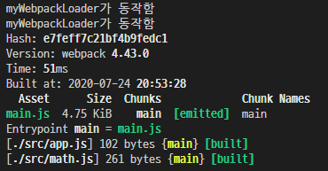
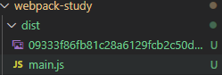
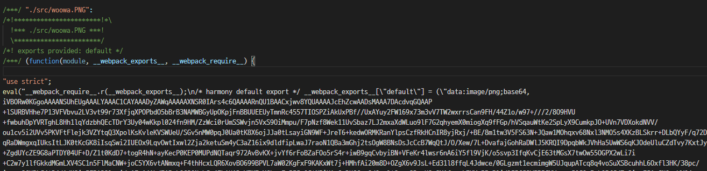

## ✌ 로더
- 웹팩은 모든 파일을 모듈로 바라본다.
- 자바스크립트 뿐만 아니라, CSS, 이미지, 폰트까지도 전부 모듈로 보기 때문에 import 구문을 사용하면 자바스크립트 코드 안으로 가져올 수 있다.
- 이것이 가능한 이유는 웹팩에 **로더**가 있기 때문이다.
    - 모든 파일을 자바스크립트의 모듈처럼 만들어준다.
    - CSS 파일을 자바스크립트에서 직접 로딩해서 사용할 수 있게 해준다.
    - IMG 같은 파일 형식을 데이터 URL 형식의 문자열로 변환한 다음에 자바스크립트에서 이미지 파일을 사용할 수 있게 해준다.
### 🔸 커스텀 로더 만들기
- `my-webpack-loader.js` 작성
- `webpack.config.js` 수정
    - `test` : 로더가 처리해야될 파일들의 패턴을 입력한다. (정규 표현식)
    - `use` : 사용할 로더를 명시한다.
<pre>
  module:{
    rules:[
      {
        test: /\.js$/,   //(.js로 끝나는 모든 파일명을 로더로 돌리겠다.)
        use: [
          // 모든 .js로 끝나는 파일들에서 my-webpack-loader.js가 실행되게끔 설정
          path.resolve('./my-webpack-loader.js')
        ] 
      }
    ]
  }
</pre>
- `npm run build` 로 웹팩 실행

- 콘솔에 `myWebpackLoader가 동작함` 두번찍힌 이유는 src에 app.js와 math.js가 존재하고 js파일별로 로더를 실행하라고 명시했기 때문이다.
- `my-webpack-loader.js`를 `console.log`를 만나면 `alert`창을 띄우게 바꿔본다.
    - `app.js`에 있는 `console.log`를 `alert`창으로 변경하여 alert이 뜬다.
<pre>
return content.replace('console.log(','alert(');
</pre>
- 웹팩의 로더는 각 파일을 처리하기 위한 용도이다.
- 처리해야될 파일의 패턴을 명시하고 이 패턴에 걸리는 파일들은 `use`에 설정한 로더함수를 돌리도록 한다.

### 🔸 자주 사용하는 대표적인 로더
> - [loader 공식 문서](https://webpack.js.org/loaders/)
### 🌂 [css-loader](https://webpack.js.org/loaders/css-loader/)
- 자바스크립트에서 css 파일을 모듈로 불러올 수 있게 해준다.
- es6의 import 구문으로 가져오려면 css 파일이 모듈이 되어야만 하는데 웹팩의 로더가 이 css 파일을 모듈로 바꾸는 역할을 한다.
- 만약 로더를 사용하지 않은채 `import './app.css';` 하면 오류가 난다. (`Module parse failed`)

- 사용하기 위해서 `css-loader`를 설치한다.
<pre>
$ npm i css-loader
</pre>
- `webpack.confing.js` 수정
<pre>
{
  test: /\.css$/,
  use:[
      // 웹팩은 엔트리 포인트부터 시작해서 연결된 모든 모듈을 검색하여 css-loader를 찾는다.
    'css-loader'
  ]
}
</pre>
- 설정 후 `npm run build` 성공
- dist/main.js에 css가 있는게 확인된다.
- **하지만 브라우저상에서는 적용이 되지 않는다.**
    - html 코드가 DOM이라는 모습으로 변환이 되어야 브라우저에서 문서가 보이듯이 css 코드도 CSSOM(CSS 객체 모델)으로 바뀌어야만 브라우저에서 모습을 들어낸다.
    - 이렇게 하려면 HTML 파일에서 css 코드를 직접 불러오거나 아니면 인라인 스크립트로 넣어주어야 하는데 아직 그런 처리를 하지 않고 이 자바스크립트 파일에만 CSS 코드가 있어서 브라우저에서 나타나지 않는다.
    - 그래서 나온 것이 **style-loader**이다.
### 🌂 [style-loader](https://webpack.js.org/loaders/style-loader/)

- **style-loader**는 자바스크립트로 변경된 style 코드를 HTML에 넣어주는 loader 이다.
- css코드를 모듈로 사용하고 웹팩으로 번들링하려면 `css-loader`와 `style-loader`를 같이 사용해야 한다.
- `style-loader` 설치
<pre>
$ npm i style-loader
</pre>
- `webpack.config.js`에 `style-loader`추가
- **중요한 점은 로더는 한 파일에 대해서 여러 개가 실행될 수 있는데 use의 순서는 뒤에서부터 앞으로 실행되기 때문에 유의해서 설정해주어야 한다.**
<pre>
{
  test: /\.css$/,
  use:[
    // css-loader부터 실행해야한다.
    'style-loader',
    'css-loader'
  ]
}
</pre>
- 설정 후 `npm run build`를 하면 성공적으로 배경화면이 바뀌게 된다.
    - inline style로 head태그 안에 style이 정의 되어 있다.

### 🌂 [sass-loader](https://webpack.js.org/loaders/sass-loader/)
- [npm](https://www.npmjs.com/package/sass-loader)
- [sass](https://sass-lang.com/)는 CSS pre-processor로서 CSS의 한계와 단점을 보완하여 보다 가독성이 높고 코드의 재사용에 유리한 CSS를 생성하기 위한 CSS의 확장(extension)이다.
- CSS의 간결한 문법은 배우기 쉬우며 명확하여 프로젝트 초기에는 문제가 없이 보이지만 프로젝트의 규모가 커지고 수정이 빈번히 발생함에 따라 쉽게 지저분해지고 유지보수도 어려워지는 단점도 가지고 있다.
- 이러한 CSS의 태생적 한계를 보완하기 위해 Sass는 다음과 같은 추가 기능과 유용한 도구들을 제공한다.
    - 변수의 사용
    - 조건문과 반복문
    - Import
    - Nesting
    - Mixin
    - Extend/Inheritance
- CSS와 비교하여 Sass는 아래와 같은 장점이 있다.
    - CSS보다 심플한 표기법으로 CSS를 구조화하여 표현할 수 있다.
    - 스킬 레벨이 다른 팀원들과의 작업 시 발생할 수 있는 구문의 수준 차이를 평준화할 수 있다.
    - CSS에는 존재하지 않는 Mixin 등의 강력한 기능을 활용하여 CSS 유지보수 편의성을 큰 폭으로 향상시킬 수 있다.
- sass-loader 설치
<pre>
$ npm install sass-loader sass
</pre>
- `webpack.config.js`에 `sass-loader` 추가
<pre>
{
  test: /\.(scss|css)$/,
  use:[
    process.env.NODE_ENV === 'production' 
    ? MiniCssExtractPlugin.loader
    : 'style-loader',
    'css-loader',
    'sass-loader'
  ]
},
</pre>
- `npm run build`를 하면 성공적으로 sass파일이 css로 변환된것을 확인할 수 있다.

### 🌂 [file-loader](https://webpack.js.org/loaders/file-loader/)
- CSS 뿐만 아니라 소스코드에서 사용하는 모든 파일을 모듈로 사용하게끔 할 수 있다.
- css에서 이미지를 불러올 때 에러가 발생한다.
- 이미지를 처리할 수 있는 로더가 `file-loader`이다.
<pre>
body{
    background-image: url(bg.jpg);
}
</pre>
- `file-loader` 설치
<pre>
$ npm i file-loader
</pre>
- `webpack.config.js`에 `file-loader` 추가
<pre>
{
  test: /\.jpg$/,
  use:[
    'file-loader'
  ]
}
</pre>
- 설정 후 `npm run build`를 하면 dist/ 파일에 해시값으로 이미지가 생성된 것을 확인할 수 있다.

- 웹팩은 빌드를 할 떄 마다 unique한 값을 생성한다.
    - 하는 이유는 캐시 갱신을 위해서 처리한 것이다.
    - 정적 파일인 경우에 브라우저에서 캐시하는 경우는 자바스크립트나 css, 이미지, 폰트들을 성능을 위해서 캐시를 한다.
- 하지만 이렇게 해서 background image가 설정되지 않는다
    - 이미지 url이 설정이 제대로 안되어있기 때문이다.
- `webpack.config.js`의 `file-loader` 수정
    - `options`의 `publicPath` : `file-loader`가 처리하는 파일을 모듈로 사용했을 때 그 경로 앞에 추가되는 문자열로(아웃풋 경로가 dist로 설정되어 있다.), 파일을 호출할 때 앞에 dist를 붙치고 호출하게 된다.
    - `options`의 `name` : `file-loader` 파일 아웃풋으로 복사 할 때 사용하는 파일의 이름을 설정한다.(`[원본 파일명].[확장자 명][해시]`)
    - `[해시]` 캐시 무력화를 위해서 쿼리 스트링으로 매번 달라진 해시값을 입력한다.
<pre>
{
  test: /\.jpg$/,
  loader: 'file-loader', // 로더 이름 설정
  options:{ // 로더에 대한 옵션
    publicPath:'./dist/',
    name: '[name].[ext]?[hash]' 
  }
}
</pre>
- 설정 후 `npm run build`를 하면 ./dist 폴더에 이미지 이름대로 저장되어있는것이 확인이 가능하다.

- `./dist/main.js`에서 `bg.jpg`를 찾아보면 접두사와 쿼리스트링으로 매번바뀌는 해시값이 설정되어 호출된 것을 확인 할 수 있다.
- 때문에 호출할 때마다 해시값이 바뀌기 때문에 캐시와 관련된 문제를 해결할 수 있다.

### 🌂 [url-loader](https://webpack.js.org/loaders/url-loader/)
- 사용하는 이미지 개수가 많아지면 네트웍 리소스를 사요하는 부담이 있고 사이트 성능에도 영향을 줄 수 있다.
- 한 페이지에서 작은 이미지를 여러개 사용한다면 [Data URI Scheme](https://en.wikipedia.org/wiki/Data_URI_scheme)을 이용하는 방법이 더 낫다.
- `url-loader`라는 것은 `Data URI Scheme`처럼 이미지를 base64로 인코딩하여 문자열 형태로 소스코드에 넣는 형식이다.
- `url-loader`는 이러한 처리를 자동화해준다.
<pre>
$ npm i url-loader
</pre>
- `url-loader` 설치후 `webpack.config.js`를 수정
    - `url-loader`가 파일들을 처리할 때 `limit` 크기 미만의 파일은 `url-loader`로해서 `base64`로 변환한다.
    - `limit` 크기 이상인 경우는 `file-loader`가 실행하도록 한다.
    - `limit` 크기 미만은 javascript 문자열로 변환하고 그 이상은 파일을 복사한다.
    - 이렇게 하면 `limit` 크기 미만 파일은 `./dist/main.js`에 들어오게 된다.
<pre>
{
  test: /\.(jpg|PNG|gif|svg)$/,
  <b>loader: 'url-loader', </b>
  options:{ 
    publicPath:'./dist/',
    name: '[name].[ext]?[hash]' ,
    <b>limit: 80000,</b> // 80kb 파일 크기를 설정할 수 있다.
  }
}
</pre>
- `./dist/main.js`에 확인해보면 80kb 보다 작은 파일은 main.js에 적혀있는것을 확인할 수 있다.

