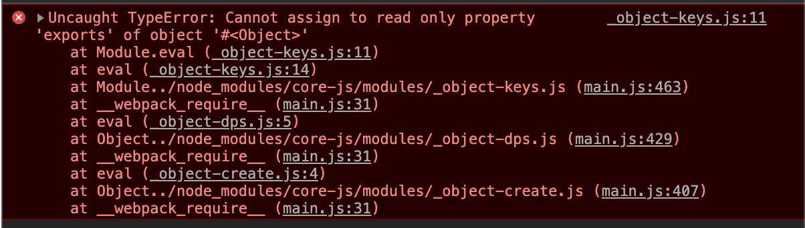

# ✌ 웹팩(심화)
> https://jeonghwan-kim.github.io/series/2020/01/02/frontend-dev-env-webpack-intermediate.html
> https://webpack.js.org/configuration/dev-server/
## 🌈 웹팩 개발 서버
- 프론트 엔드 개발환경에서 개발 서버를 제공해 주는 것이  [webpack-dev-server](https://webpack.js.org/configuration/dev-server/)이다.
- 운영환경과 맞춤으로써 배포시 잠재적인 문제를 미리 확인할 수 있다. 계다가 ajax 방식의 API 연동은 cors정책 때문에 반드시 서버가 필요하다.
- 패키지 설치
<pre>
$ npm i webpack-dev-server
</pre>
- `package.json`에 `script`에 추가
<pre>
  "scripts": {
    "test": "echo \"Error: no test specified\" && exit 1",
    "build": "webpack",
    "lint": "eslint src --fix",
    <b>"start": "webpack-dev-server"</b>
  },
</pre>
- `$ npm start`를 하면 `webpack-dev-server`가 실행된다.

#### 📌 `webpack-dev-server`로 실행하는 도중 아래와 같은 오류가 계속 발생하였다.

- 처음에는 ESLint 때문에 그런줄 알았는데 인터넷에 검색해본 결과 `Uncaught TypeError: Cannot assign to read only property 'exports' of object '#<Object>'` 오류는 명확하게 답이 나와있지 않았다.
- 그냥 `import`와 `require`같은 commonJS와 ES6를 같이 사용해서 그렇다고 나와있었다.
> https://github.com/webpack/webpack/issues/4039

- *module.exportsES 모듈 내에서 CommonJS 스타일을 사용하려고 할 때만 발생했습니다.*
- 그래서 한참을 찾았는데 문제는 babel에 있었다.
- 같이 사용하게 해야되기때문에 `babel.config.js`를 수정해주어야만 했다.
- 처음 찾은 것은 babel의 `sourceType`을 `unambiguous`롤 수정해주어 같이 사용하게 하는 방법이였다.
> https://babeljs.io/docs/en/options#sourcetype
<pre>
sourceType: "unambiguous",
  presets: [
    ...
  ]
</pre>
- `@babel/preset-env`를 사용한 `corejs` 폴리필을 사용하기 때문에 옵션인 `useBuiltIns`을 사용하여 같이 사용하게 하는 방법이였다.
- `useBuiltIns`을 `entry`로 변경해주었다.
- https://babeljs.io/docs/en/babel-preset-env#usebuiltins

---

- 웹팩 개발 서버가 돌면서 파일 변환을 감지하여 웹팩 개발 서버가 다시 실행되고 그 결과가 서버를 다시 실행하지 않고도 바로 브라우저에 반영이 된다.

### 🔸 웹팩 개발 서버 기본 설정
- 웹팩 설정 파일(`webpack.config.js`)의 `devServer` 객체에 개발 서버 옵션을 설정할 수 있다.
  - `contentBase`: 정적 파일을 제공할 경로. 기본값은 **웹팩 아웃풋**이다. (현재 `/dist`)
  - `publicPath`: 브라우저를 통해 접근하는 경로. 기본값은 `/`이다.
  - `host`: 개발환경에서 도메인을 맞추어야 하는 상황에서 사용된다. 예를 들어 쿠기 기반 인증은 인증 서버와 동일한 도메인으로 개발환경을 맞추어야 한다.
  - `overlay`: 빌드시 에러나 경고를 브라우저 화면에 표시한다.
  - `port`: 개발 서버 포트 번호를 설정한다. 기본값은 8080
  - [`stats`](https://webpack.js.org/configuration/dev-server/#devserverstats-): 메시지 수준을 정할 수 있다. `none`, `errors-only`, `minimal`, `normal`, `verbose`로 메시지 수준을 조절한다.(웹팩 서버를 돌렸을 떄 나오는 메시지(콘솔)를 말한다.)
  - `historyApiFallBack`: 히스토리 API를 사용하는 SPA 개발시 설정한다. 404가 발생하면 index.html로 리다이렉트한다.
- `webpack.config.js`파일의 웹팩 `output`설정 아래에 추가한다.
<pre>
  devServer: {
    overlay: true,
    stats: "errors-only",
  },
</pre>
- `package.json`에 `scripts`부분의 웹팩 서버를 실행하는 `start`를 빌드상태를 0% ~ 100% 까지 볼 수 있게 변경해준다.
<pre>
  "scripts": {
    ...
    "start": "webpack-dev-server --progress"
  },
</pre>