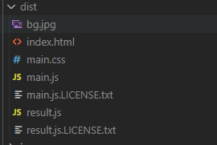
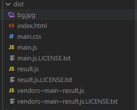

# ✔ 최적화
- 코드가 많아지면 번들링된 결과물도 커지기 때문에 브라우저 성능에 영향을 줄 수 있다. (파일을 다운로드하는데 시간이 많이 걸리기 때문이다.)
- 어떻게 웹팩으로 번들 결과를 압축하고 또 상황에 따라서 작은 파일 여러 개로 분리할 수 있는지를 확인한다.
- 번들링한 결과물을 어떻게 최적화 할 수 있는지를 확인한다.

## 🌈 production 모드
- 웹팩 내장되어 있는 최적화 방법 중 [`mode`](https://webpack.js.org/configuration/mode/) 값을 설정하는 방식이 기본이다.
<pre>
// webpack.config.js
mode: "development",
</pre>

- 세 가지 값이 올 수 있는데 지금까지 설정한 `development`는 디버깅 편의를 위해 두 개 플러그인을 사용한다.
    - `NamedChunksPlugin`
    - `NamedModulesPlugin`
- 추가로 `DefinePlugin`을 사용한다면 `process.env.NODE_ENV` 값이 `development`로 설정되어 어플리케이션에 전역변수로 주입된다.
- 반면, mode를 `production`으로 설정하면 자바스크립트 결과물(번들링된 결과물)을 최소화 하기 위해 7개의 플러그인을 사용한다.
    - `FlagDependencyUsagePlugin`
    - `FlagIncludedChunksPlugin`
    - `ModuleConcatenationPlugin`
    - `NoEmitOnErrorsPlugin`
    - `OccurrenceOrderPlugin`
    - `SideEffectsFlagPlugin`
    - `TerserPlugin`
- 추가로 `DefinePlugin`을 사용한다면 `process.env.NODE_ENV` 값이 `production`로 설정되어 어플리케이션에 전역변수로 주입된다.
- 그럼 환경변수 `NODE_ENV`값에 따라 모드를 설정하도록 웹팩 설정 코드를 추가할 수 있다.
<pre>
// webpack.config.js
const mode = process.env.NODE_ENV || "development";
module.exports = {
  mode,
  ...
}
</pre>
- 윈도우는 `cross-env`를 붙여야 한다.
<pre>
// package.json
"scripts": {
    "build": "cross-env NODE_ENV=production webpack --progress",
    ...
  },
</pre>
- `npm run build`를 하면 빌드된 파일을 확인해보면 모든 코드가 압축된 것을 확인할 수 있다.

## 🌈 optimazation 속성으로 최적화
- 빌드 과정을 커스터마이징할 수 있는 여지를 제공하는데 그것이 [`optimazation`](https://webpack.js.org/configuration/optimization/) 속성이다.
- `HtmlWebpackPlugin`이 html 파일을 압축한것 처럼 css 파일도 빈칸을 없애는 압축을 하려면 [`optimize-css-assets-webpack-plugin`](https://webpack.js.org/plugins/mini-css-extract-plugin/#minimizing-for-production)을 사용한다.
<pre>
$ npm i optimize-css-assets-webpack-plugin
</pre>
- `production`일 때, `optimize-css-assets-webpack-plugin` 생성자를 호출한다.
<pre>
// webpack.config.js
const OptimizeCssAssetsPlugin = require("optimize-css-assets-webpack-plugin");
...
module.exports = {
  ...
  optimization: {
    minimizer: mode == "production" ? [new OptimizeCssAssetsPlugin()] : [],
  },
  ...
}
</pre>
- `npm run build`를 하면 css 파일이 압축된 것을 확인할 수 있다.
- `mode=production`일 경우 사용되는 [`TerserWebpackPlugin`](https://webpack.js.org/plugins/terser-webpack-plugin/)은 자바스크립트 코드를 난독화하고 debugger 구문을 제거한다.
- 기본 설정 외에도 [콘솔 로그를 제거하는 옵션](https://github.com/terser/terser#compress-options)도 있는데 배포 버전에는 로그를 감추는 것이 좋을 수도 있기 때문이다.
<pre>
$ npm i terser-webpack-plugin
</pre>
- `production`일 때, `terser-webpack-plugin` 생성자를 호출한다.
<pre>
const TerserPlugin = require("terser-webpack-plugin");
...
  optimization: {
    minimizer:
      mode == "production"
        ? [
            new OptimizeCssAssetsPlugin(),
            <b>new TerserPlugin({
              terserOptions: {
                compress: {
                  drop_console: true, // 콘솔로그를 제거한다.
                },
              },
            }),</b>
          ]
        : [],
  },
</pre>

## 🌈 코드 스플리팅
- 코드를 압축하는 것 외에도 아예 결과물을 여러개로 쪼개면 좀 더 브라우저 다운로드 속도를 높일 수 있다.
- 큰 파일 하나를 다운로드 하는것 보다 작은 파일 여러개를 동시아 다운로드하는 것이 더 빠르기 때문이다.
- 가장 단순한 것은 **엔트리를 여러개**로 분리하는 것이다.
<pre>
module.exports = {
  mode,
  entry: {
    main: "./src/app.js",
    <b>result: "./src/result.js",</b>
  },
...
}
</pre>
- 두개의 엔트리 포인트가 생겼다.
- 또한, index.html을 확인해보면 `main.js`와 `result.js` 두개의 파일을 로딩하는 것을 볼 수 있다.

- 하지만 두 파일을 비교해보면 중복된 코드들이 존재한다.
- 그렇기 때문에 중복을 제거하는 옵션도 켜주어야 한다.
<pre>
splitChunks: {
  chunks: "all", // 중복된 코드를 제거하고 엔트리 포인트를 다시 빌드한다.
},
</pre>
- `npm run build`를 해주면 `vendors`라는 파일이 추가로 생성된 것을 확인할 수 있다.
- `main.js`와 `result.js`에서 중복되어 사용되는 코드를 따로 빼서 `vendors` 파일에 들어간다.

- 엔트리 포인트를 직접 개발자가 나누어주는 것은 손이 많이 간다.
- 이 작업을 자동화하는 작업은 웹팩에서 **다이나믹 임포트**라고 한다.

## 🌈 다이나믹 임포트
- `app.js`에서 `result.js`를 `import`하는 부분을 주석처리하고 수정한다.
- `/* webpackChunkName: "result" */`의 특별한 주석을 사용하여 웹팩이 이 주석을 보고 알아서 result라는 번들 결과를 따로 만들어준다.
<pre>
  // result 모듈을 가져올 수 있다.
  import(/* webpackChunkName: "result" */ "./result").then(async (m) => {
    // default로 빼내고 있는 모듈을 설정해준다.
    const result = m.default;
    resultEl = document.createElement("div");
    resultEl.innerHTML = await result.render();
    document.body.appendChild(resultEl);
  });
</pre>
- 대신에 아까 `webpack.config.js`에서 설정해주었던 일일히 엔트리 포인트를 나누어주었던 부분을 제거해준다.
- `npm run build`를 해준다.

## 🌈 externals
- 마지막 방법으로 애초에 번들하지 말하야할 대상들은 빌드 범위에서 빼버리는 방법이다.
- 바로 axios같은 써드파티 라이브러리다. 패키지로 제공될 때 이미 빌드 과정을 거쳤기 때문에 빌드 프로세스에서 제외하는 것이 좋다.
- 웹팩 설정중 [`externals`](https://webpack.js.org/configuration/externals/)가 바로 이러한 기능을 제공한다.
- `externals`에 추가하면 웹팩은 코드에서 axios를 사용하더라도 번들에 포함하지 않고 빌드한다.
<pre>
  ...
  // 웹팩으로 빌드할 때 axios 모듈을 사용하는 부분이 있으면 전역변수 axios를 사용하는 것으로 간주하라는 의미이다.
  externals: {
    axios: "axios",
  },
  ...
</pre>
- `axios`는 이미 `node_modules`에 위치해 있기 때문에 이를 웹팩 아웃풋 폴더에 옮기고 `index.html`에서 로딩해야한다. 
- 그렇기 때문에 파일을 복사하는 `CopyWebpackPlugin`을 설치한다.
<pre>
$ npm i copy-webpack-plugin
</pre>
- `webpack.config.js` 수정 
<pre>
const CopyPlugin = require('copy-webpack-plugin');
...
module.exports = {
  plugins: [
    ...
    new CopyPlugin({
      patterns: [
        {
          from: "./node_modules/axios/dist/axios.min.js", // 여기있는 파일을
          to: "./axios.min.js", //여기로 가져온다.
        },
      ],
    }),
  ]
}
</pre>
- 그리고 index.html에서는 axios를 로딩하는 코드를 추가한다.
<pre>
// index.html
< script type="text/javascript" src="axios.min.js">< /script>
</pre>
- `npm run build`를 하면 `./dist`에 `axios.min.js`가 생성되어있는 것을 확인할 수 있다.