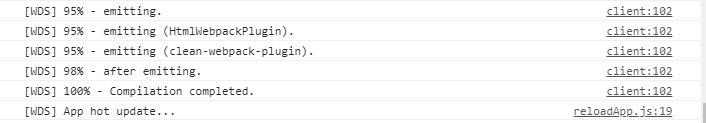
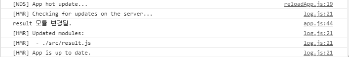

# ✔ 핫 모듈 리플레이스먼트
- 웹팩 개발서버는 코드의 변화를 감지해서 전체 화면을 갱신하기 때문에 개발 속도를 높일 수 있지만 어떤 상황에서는 전체 화면을 갱신하는 것이 좀 불편한 경우도 있다.
- 전체 화면 갱신 하지 않고 **변경한 모듈만** 바꿔치기 하는 **핫 모듈 리플레이스먼트**는 웹팩 개발서버의 한 기능이다.
- 변경되지 않은 데이터들은 유지를 한다.
- app.js와 form.js result.js 작성

## 🌈 설정
- `webpack.config.js`의 `devServer`에 핫 모듈 리플레이이스먼트를 사용할 수 있게 추가해준다.
<pre>
  devServer: {
    overlay: true,
    stats: "errors-only",
    // 웹팩 개발 서버 객체를 받는다.
    before: (app) => {
      // 미들웨어를 추가하는 형식
      app.use(apiMocker("/api", "mocks/api"));
    },
    // 핫 모듈 리플레이스먼트 사용
    <b>hot: true,</b>
  },
</pre>
- 이렇게 하고 `npm start`를 하면 console창에 `App hot update...`라는 메시지가 추가로 나오면 핫 모듈이 시작된 것이다.
- 웹팩에서 간단히 핫 모듈을 킬 수 있다.

- 핫 모듈 리플레이스먼트를 제대로 사용할려면 제공하는 모듈이 핫 모듈 리플레이스먼트(`HMR`) 인터페이스를 맞추어줘야한다.
- HMR 켜면 `module.hot`에 값이 들어온다.
- `module.hot.accept` 함수는 변경을 감지할 모듈을 정할 수 있다.
<pre>
if (module.hot) {
  console.log("핫 모듈 켜짐");

  module.hot.accept("./result", () => {
    console.log("result 모듈 변경됨.");
  });
}
</pre>
- `result.js`를 변경하면 위의 콘솔이 찍힌다.

- 즉 `module.hot.accept`에다가 변경을 감지해야될 모듈명을 입력하면 그 모듈이 변경되었음을 인지하고 callback 함수가 실행된다.
- 그래서 callback함수에다가 바꿔치기 하는 명령어를 추가하면 된다.

## 🌈 핫로딩을 지원하는 로더
- 이 핫로딩을 지원하려면 `webpack.config.js`에 `hot: true`를 추가하는 것 뿐만 아니라 모듈자체가 핫 모듈 리플레이스먼트를 지원해야 된다.
- 지원한다는 것은 이러한 인터페이스를 맞추어줘야 한다는 건데 이런것을 바로 HMR 인터페이스를 맞춘다라고 한다.
- 그렇기 때문에 HMR 인터페이스를 구현해야되는데 우리가 사용하는 로더에도 이 HMR을 구현한 로더들이 있다.
- 대표적으로 `style-loader`,`sass-loader`, `file-loader`, `react-hot-loader`