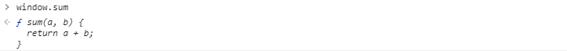
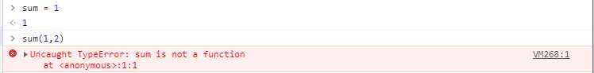
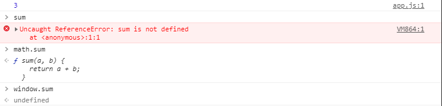

# ✔ 웹팩(기본)
> - http://jeonghwan-kim.github.io/series/2019/12/10/frontend-dev-env-webpack-basic.html
## ✌ 과거의 경우
- html에 파일 두개를 올려서 다른 파일에 있는 함수를 사용했었다.
<pre>
< script src="src/math.js">< /script>
< script src="src/app.js">< /script>
</pre>
#### ❗ 하지만 이런 방법에는 문제가 존재한다.
- 전역 스코프가 오염된다.
- math.js의 sum이라는 함수는 math 모듈 안에서만 유효한 것이 아니라 해당 애플리케이션이 돌아가는 어느 곳에서나 sum 함수에 접근이 가능하다.

- 자바스크립트는 이런 함수 타입에다가 다른 값을 할당할 수 있다.

- 이렇게 타입 에러가 발생하게 된다.
- 이렇듯 전역 스코프가 오염되게 되면 애플리케이션이 예측할수 없게 되고 결국엔 런타임 에러가 발생하게 된다.
- 이런 문제를 해결하기 위해서 IIFE 방식의 모듈을 사용을 한다.

## ✌ IIFE 방식의 모듈
- 즉시 실행 함수 표현(IIFE, Immediately Invoked Function Expression)은 정의되자마자 즉시 실행되는 Javascript Function 를 말한다.
- https://developer.mozilla.org/ko/docs/Glossary/IIFE
- 이렇게 되면 함수 안에 독립적인 스코프가 생기게 된다. (외부에서 접근할 수 없다.)
    - 즉, 전역 스코프가 오염되는 문제를 예방할 수 있다.
<pre>
var math = math || {};

(function () {
  function sum(a, b) {
    return a + b;
  }
  // 외부로 호출
  math.sum = sum;
})();
</pre>

## ✌ 다양한 모듈 시스템
- https://www.zerocho.com/category/JavaScript/post/5b67e7847bbbd3001b43fd73
- 대표적으로 `AMD` 와 `CommonJS`
- `CommonJS`는 자바스크립트를 사용하는 모든 환경에서 모듈을 하는 것이 목표로 `exports` 키워드로 모듈을 만들고 `require()` 함수로 불러 들이는 방식으로 대표적으로 서버 사이드 플래폼인 Nodejs에서 사용한다.
- 브라우저 환경에서는 [AMD](https://en.wikipedia.org/wiki/Asynchronous_module_definition)(*Asynchronous Module Definition*)는 비동기로 로딩되는 환경에서 모듈을 사용한다. (브라우저처럼 외부자바스크립트를 로딩해야할 때(비동기 환경))
- `CommonJS`와 `AMD`를 보두 지원해주는 것이 `UMD`(*Universal Module Definition*)
- 이렇게 각 커뮤니티에서 각자의 스펙을 제안하자 ES2015에서 표준 모듈 시스템을 내 놓았다.
    - 바벨이나 웹팩을 사용해서 모듈 시스템을 사용하는 것이 일반적이다.
<pre>
// export 할 때
export function sum(a, b) {
  return a + b;
}
// import 할 때
import * as math from "./math.js";
import { sum } from "./math.js";
</pre>

## ✌ 브라우져의 모듈 지원
- 모든 브라우져에서 모듈 시스템을 지원하지 않는다.(explorer..)
- 크롬 브라우저에서 사용할때
<pre>
 < script type="module" src="src/app.js">< /script>
</pre>